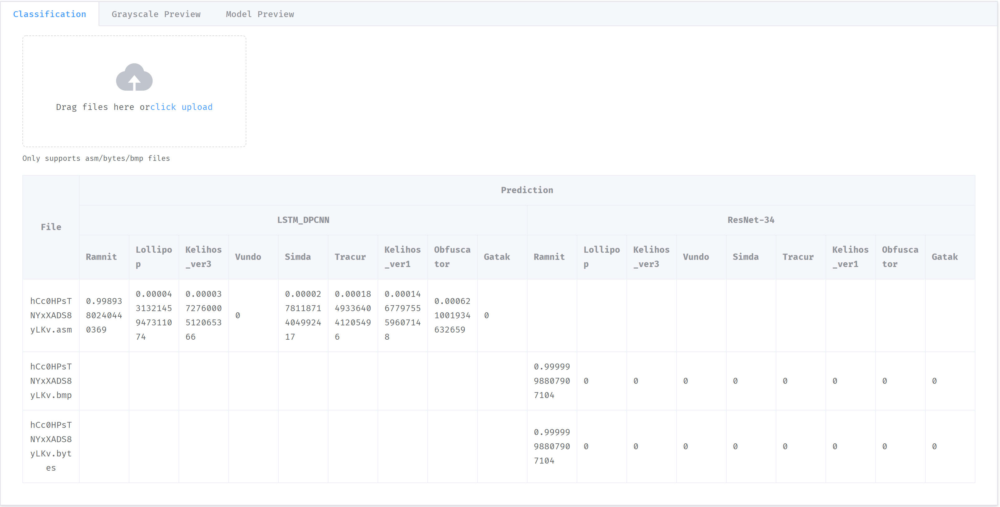

# Malware Classification
This is my undergraduate graduation design at Beijing Institute of Technology. It is a malware classification system based on [DPCNN (Deep Pyramid Convolutional Neural Networks for Text Categorization)](https://ai.tencent.com/ailab/media/publications/ACL3-Brady.pdf), [ResNet](https://arxiv.org/pdf/1512.03385.pdf) and LSTM.
## Environment
The code is developed using Python 3.6 on Windows 10. NVIDIA GPUs are needed. The code is developed and tested using NVIDIA GeForce GTX 1060.
## Requirement
```
torch == 1.1.0
torchvision == 0.3.0
gensim == 3.8.0
CUDA == 9.0
cuDNN == 7.0
Pillow == 6.0.0
Flask == 1.0.3
```
## Dataset
The dataset is from *Microsoft Malware Classification Challenge (BIG 2015)*. Samples in the dataset are a set of known malware files representing a mix of 9 different families. You can learn more about this dataset from this [kaggle competition](https://www.kaggle.com/c/malware-classification/data).
## Usage
#### ASM
```shell
cd ./MalwareClassification
python -m asm.run -h
```
```shell
usage: main.py [-h] [--name] [--epoch] --model  mode

Malware Classification.

positional arguments:
  mode        specify "train" or "test"

optional arguments:
  -h, --help  show this help message and exit
  --name      the name of model ([LSTM_DPCNN](default) | [DPCNN] | [LSTM])
  --epoch     number of iterations to train model (default: 20)
  --model     the path of model, which is used to save or load model
```
#### BYTES
```shell
cd ./MalwareClassification
python -m asm.run -h
```
```shell
usage: main.py [-h] [--epoch] --model  mode

Malware Classification.

positional arguments:
  mode        specify "train" or "test"

optional arguments:
  -h, --help  show this help message and exit
  --epoch     number of iterations to train model (default: 20)
  --model     the path of model, which is used to save or load model
```
#### Flask
```shell
cd ./MalwareClassification
python app.py
```
Then you can open your browser and go to http://127.0.0.1:5000/.
## Results
|   model    | accuracy |
| :--------: | :------: |
| LSTM_DPCNN |  0.9803  |
|   DPCNN    |  0.9798  |
|    LSTM    |  0.9770  |
| ResNet-18  |  0.9775  |
## Demo
### Classification
You can upload **.asm**, **.bytes** or **.bmp** files, and the system supports uploading multiple files. After that you will get the probability these uploaded files belong to each category.

### Grayscale Images Preview
You can preview 5 grayscale images that belong to the specific category.
